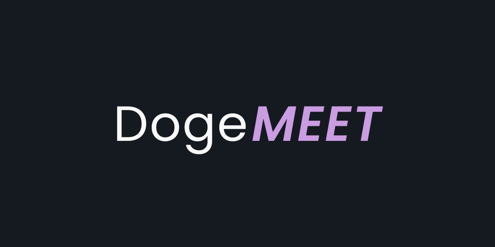
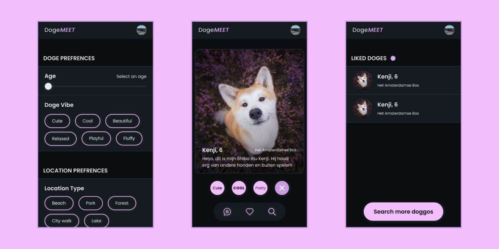

# DogeMeet

Welcome! This is my repository for my matchings feature made for project-tech. Ik worked on my website called DogeMeet. DogeMeet is a machtigings platform made for dog owners. During this project I worked on the search and like feature for DogeMeet.

# The concept

With the help of DogeMeet dog owners can connect with each other based on their beloved four legged friends! Users can, in a similar way to Tinder, swipe through other users' dogs. When two people like each other's dogs they can chat with each other. Dog owners can for example meet up to go for a walk.

# How to install

> **NOTE:** Before you can install DogeMeet be sure to have both [Node.js](https://nodejs.org/en/download/) and NPM installed. NPM should automatically be installed when installing Node.js.

You can install my project locally by running the following command in your local folder.

- `git clone https://github.com/Steinberg99/project-tech`

When you have cloned my repository be sure to run the command `npm install` to install all of the project dependencies. When you have done this you can run the command `npm start` to start DogeMeet. DogeMeet currently only works for mobile screens so be sure to select a mobile screen size using the inspector in Google Chrome (Option + ⌘ + J on macOS or Shift + CTRL + J on Windows). The website should run in the browser when visiting `localhost:4200`.

# Technologies

DogeMeet makes use of the following technologies:

- [Node.js](https://nodejs.org/en/download/),
- [Express](https://expressjs.com/),
- [Pug](https://pugjs.org/api/getting-started.html),
- [MongoDB](https://www.mongodb.com/),
- [Heroku](https://www.heroku.com/).

# License

MIT License
